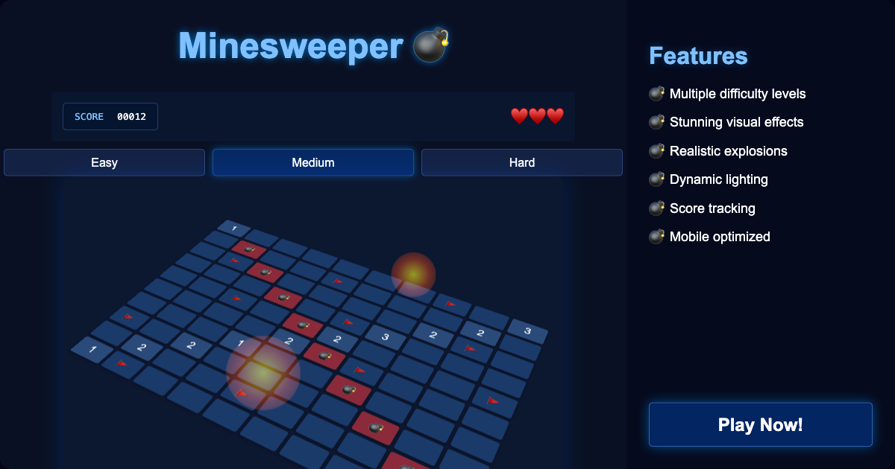

# Minesweeper 💣

## 🌟 Overview

A beautiful, modern implementation of the classic Minesweeper game with enhanced visuals and gameplay features. Challenge yourself to clear the minefield without triggering any bombs!



## 🎮 How to Play

- **Left-click** on a cell to reveal it
- **Right-click** (or long press on mobile) to place a flag on suspected bomb locations
- **Navigate** the board by rotating, zooming, and panning
- **Reach** the winning score by revealing safe cells while avoiding bombs
- **Lose a life** when you reveal a bomb - be careful!

## 💥 Game Features

- **Multiple difficulty levels:**
  - **Easy:** 10-15 bombs, 3 lives
  - **Medium:** 15-25 bombs, 3 lives
  - **Hard:** 25-35 bombs, 2 lives

- **Enhanced visuals** with realistic explosions and dynamic lighting
- **Mobile-friendly** controls with touch support
- **Score tracking** and local high score recording
- **Satisfying audio** feedback for all interactions

## 🎨 Visual Effects

- **Realistic bomb explosions** with dynamic flash, shockwave, and particle effects
- **Detailed bomb and flag models** with high-quality textures
- **Dynamic lighting system** that creates an immersive atmosphere
- **Adaptive effects** that adjust based on device capabilities
- **Smooth animations** for revealing cells and placing flags
- **Visual feedback** for all game actions to enhance player experience

## 🚀 Quick Start

```bash
git clone https://github.com/sahil0902/minesweeper
cd minesweeper
```

Then simply open `index.html` in your browser to start playing! No additional dependencies or installation required.

## 💻 Technical Details

This Minesweeper implementation is built with:
- **HTML5** for structure
- **CSS3** for styling and animations
- **JavaScript** for game logic and interactions
- **Three.js** for graphics rendering

## 🏆 Scoring System

The game tracks your score as you reveal safe cells. Each difficulty level has a different winning score threshold:
- **Easy:** 80% of safe cells
- **Medium:** 85% of safe cells
- **Hard:** 90% of safe cells

Beat your highest score and challenge friends to do better!

## 📱 Mobile Support

The game is fully optimized for mobile devices with:
- **Touch controls** (tap to reveal, long press to flag)
- **Responsive design** that adapts to different screen sizes
- **Performance optimizations** for smooth gameplay on any device
- **Reduced effects** on mobile to maintain high frame rates

## 🔊 Sound Effects

The game includes immersive sound effects for:
- Revealing cells
- Placing flags
- Explosions
- Game victory and defeat

## 👥 Credits

- Game design and development by Sahil
- Visual effects and enhancements by your friendly AI assistant
- Three.js for the 3D rendering capabilities
- Inspiration from the classic Minesweeper game

## 📄 License

This project is open source and available under the MIT License.

---

Enjoy the game! 💣 Report any issues or suggestions on the GitHub repository.

### 🔍 Future Enhancements

- Customizable themes
- Global leaderboard
- More challenging game modes
- Achievement system
